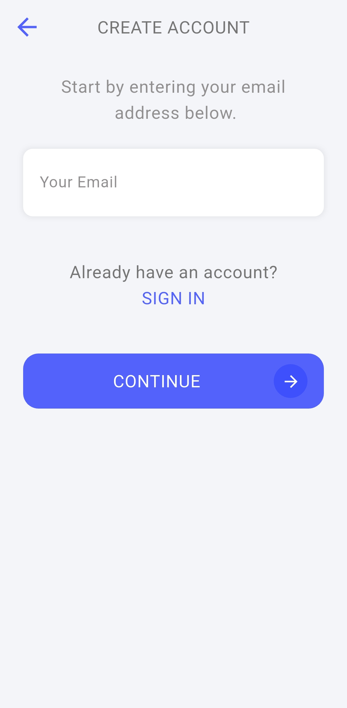
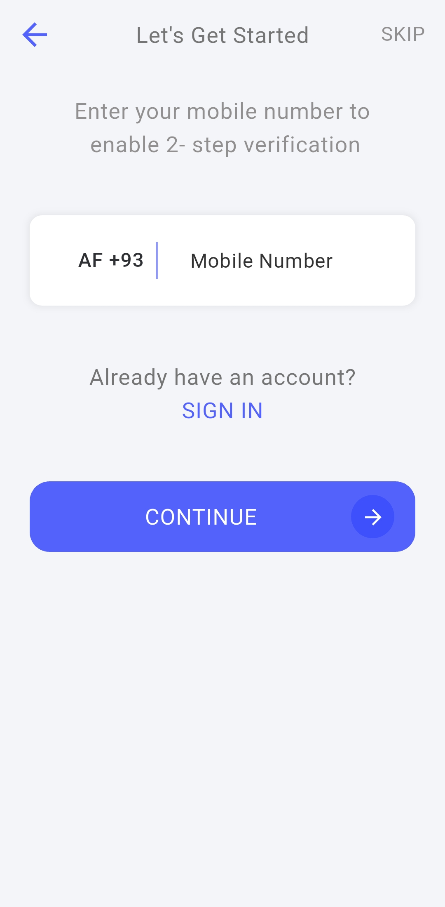
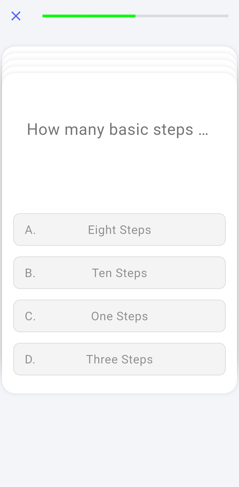
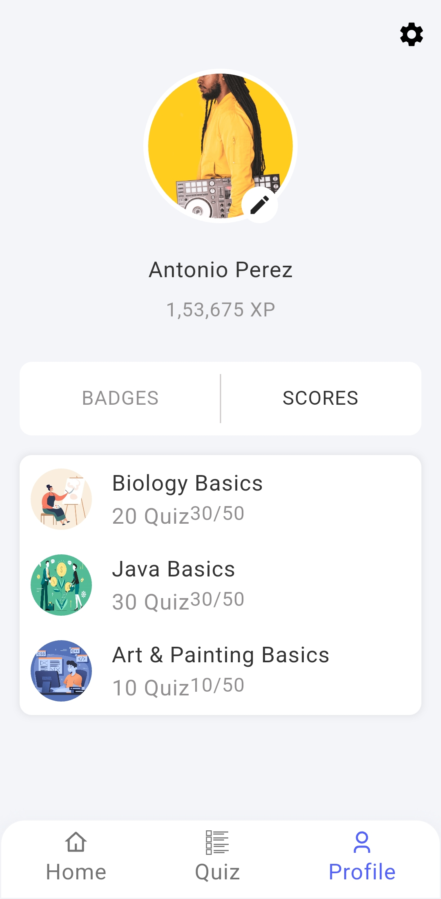

# Quiz Flutter – UI Demo

A Flutter demo app showcasing a quiz-style UI.  
This is a **UI-only** project with no backend or dynamic functionality.

---

## 📱 Overview

The app includes UI components for quizzes, including question screens, answers, and results.

---

## 🔍 Status

**Demo only** – No backend or working functionality.

---

## 📸 Screenshots

<table>
  <tr>
    <td></td>
    <td></td>
    <td></td>
    <td></td>
    <td></td>
  </tr>
  <tr>
    <td></td>
    <td></td>
    <td></td>
    <td></td>
    <td></td>
  </tr>
  <tr>
    <td></td>
    <td></td>
    <td></td>
    <td></td>
    <td></td>
  </tr>
</table>

---

## 📝 Notes

- Built entirely with Flutter
- Clean, modular UI components
- Great starting point for quiz-based apps

---

## ✍️ Created by

**Mohamed Ebrahim**
